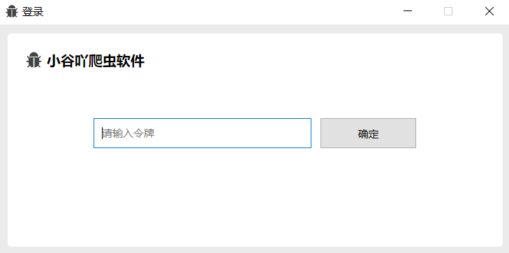
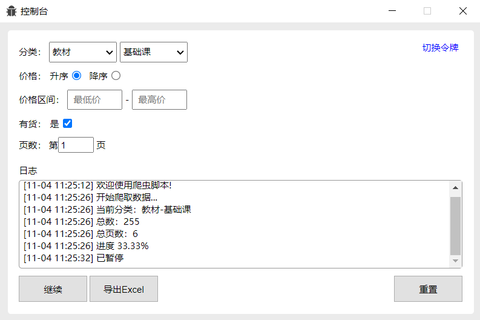
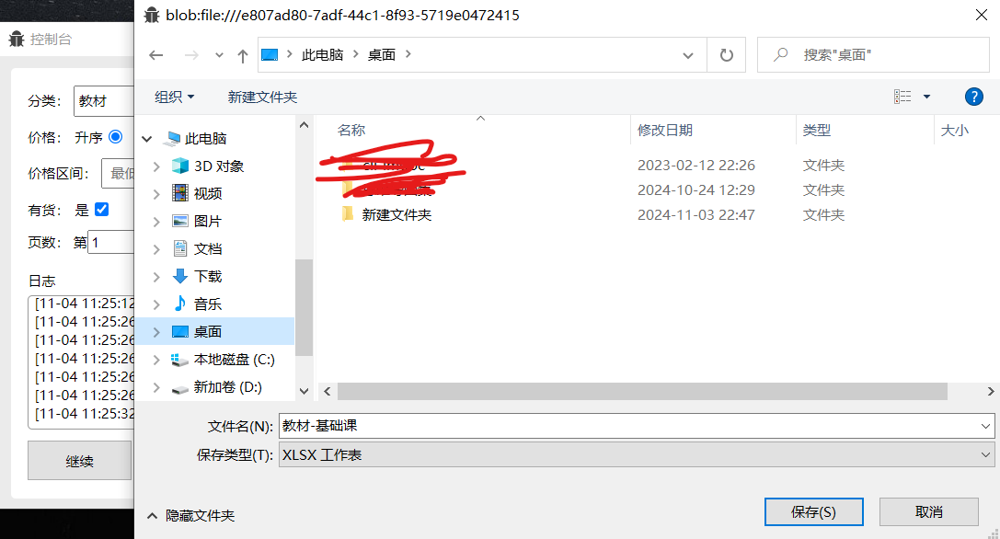
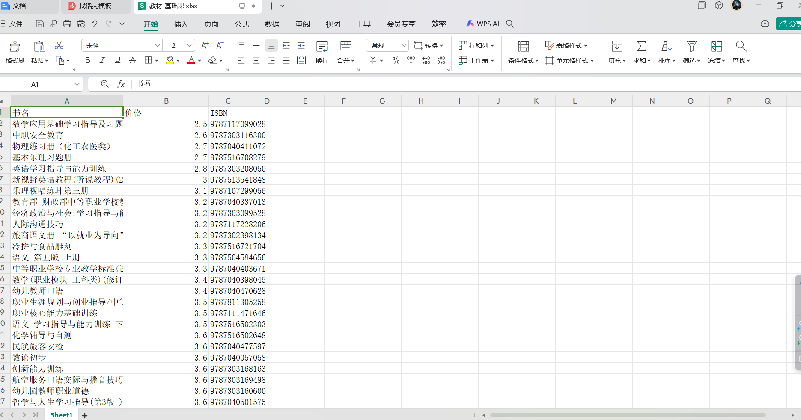

# reptile
### 介绍
这是一款基于electron开发的桌面端爬虫软件，爬取对象为小谷吖微信小程序，可自选书籍类目，可导出为Excel。

### 登录
通过输入令牌，才能登录到控制台页面。

### 控制台
可以选择书籍类目，可以依据价格降序或升序排列，可以选择价格区间等等。爬取的数据可以导出为Excel，Excel中包含书名，价格以及ISBN
。爬取过程中可以暂停，即便退出软件，下次登录时依旧可以按照之前的选项配置和数据继续爬取。

### 导出为Excel

### Excel页面
